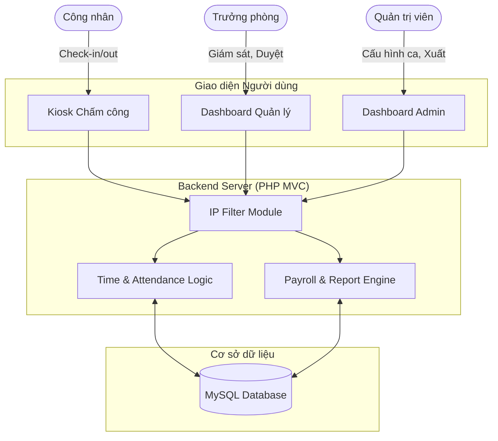

# ⏱️ Hệ thống Chấm công Tự động cho Doanh nghiệp Sản xuất (SME)

## 1. TỔNG QUAN HỆ THỐNG (SYSTEM OVERVIEW)
Đây là giải pháp phần mềm quản trị nhân sự và chấm công tự động trên nền tảng Web, được thiết kế đặc thù để thay thế quy trình quản lý thủ công (sổ sách, excel) tại các doanh nghiệp sản xuất vừa và nhỏ. Hệ thống đóng vai trò cầu nối, xử lý tự động luồng dữ liệu từ lúc nhân viên Check-in cho đến khi xuất ra Bảng tổng hợp công cuối tháng.

**Công nghệ sử dụng (Tech Stack):**
*   **Backend:** Pure PHP (MVC Architecture)
*   **Database:** MySQL (Relational Database)
*   **Frontend:** HTML5, CSS3, Vanilla JavaScript

## 2. BIỂU ĐỒ KIẾN TRÚC HỆ THỐNG (ARCHITECTURE DIAGRAM)

3. TÍNH NĂNG CỐT LÕI (CORE FEATURES)
- Hệ thống được chia thành các phân hệ nghiệp vụ độc lập, tự động đồng bộ dữ liệu:

- Cổng Nhân viên (Kiosk): Giao diện thao tác nhanh cho phép Check-in/out (bảo mật qua IP Whitelist), tra cứu nhật ký cá nhân, gửi đơn xin nghỉ phép và báo cáo sự cố (Missing Punch).

- Giám sát & Phê duyệt (Manager): Cung cấp Dashboard theo dõi quân số hiện diện thời gian thực (Real-time), duyệt đơn từ và xử lý ngoại lệ chấm công cho nhân sự dưới quyền.

- Quản trị & Xuất liệu (Admin/HR): Quản lý hồ sơ nhân viên, cấu hình tham số ca làm việc (giờ vào/ra, mốc đi muộn, tính tăng ca). Tự động bóc tách ngày công hợp lệ và xuất tệp Excel (.csv chuẩn UTF-8 BOM) phục vụ tính lương.

4. TRẢI NGHIỆM HỆ THỐNG (LIVE DEMO)
- Hệ thống đã được đóng gói và triển khai trực tiếp lên môi trường Cloud Hosting.

- Đường dẫn truy cập: https://timekeeping-system.rf.gd/timekeeping-system/public/profile

- Tài khoản Quản trị (Admin Demo):

- Tên đăng nhập: ADMIN

- Mật khẩu: 123456
